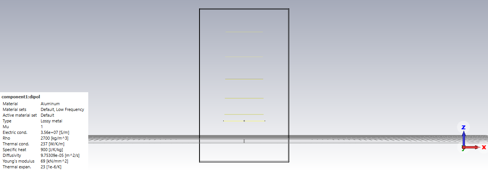
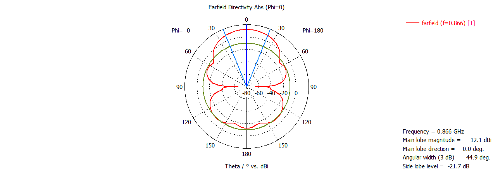
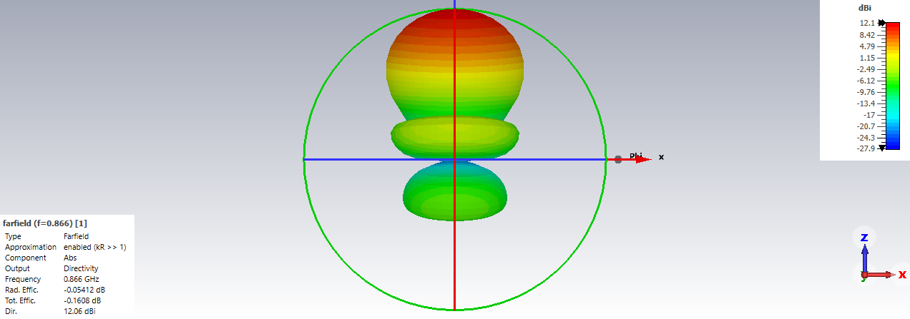
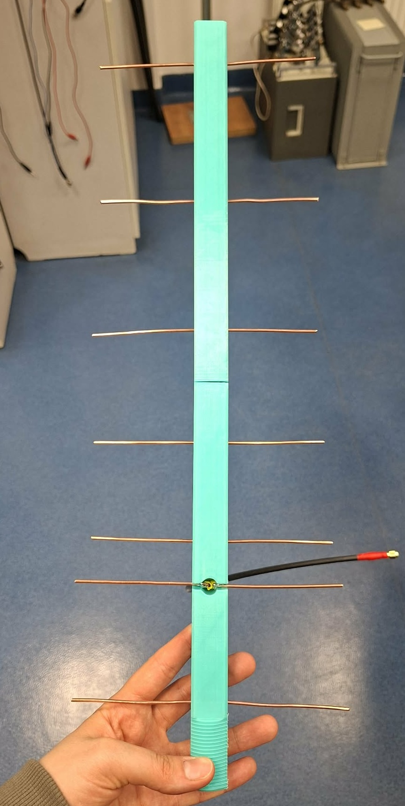
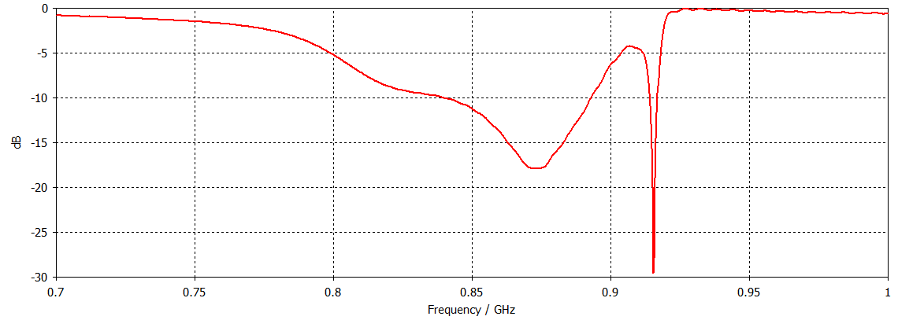
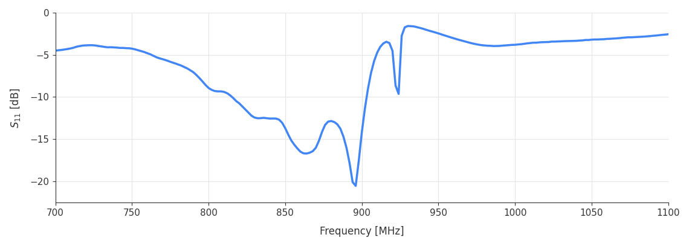

# 3D-Printed Yagi-Uda Antenna for 868 MHz

This directional Yagi-Uda antenna was designed, simulated, and constructed as a key technical component of an educational radio-localization field game titled **"Fox Hunting"**.

### 1. Antenna Dimensions
The geometry was calculated using the **DL6WU** algorithm and then optimized in **CST Studio** for the 868 MHz LoRa receiver.
* **Center Frequency:** 868 MHz ($\lambda = 345\text{ mm}$)
* **Total Elements:** 7 elements, including 1 reflector, 1 dipole, and 5 directors
* **Boom Length:** 416 mm (compact for handheld field use).
* **Element Diameter:** 2 mm round copper wire.

*Full dimensions are stored in the `antenna_dimensions.txt` file.*

### 2. CST Simulation
The antenna was modeled and simulated in **CST Microwave Studio** to verify its performance before manufacturing.

* **Gain:** $12.06\text{ dBi}$
* **3 dB Angular Width:** $44.9^\circ$
* **Side Lobe Level:** $-21.7\text{ dB}$
* **$S_{11}$ (at 868 MHz):** $\approx -17\text{ dB}$

#### Antenna Model in CST:

#### Farfield Radiation Pattern (2D Polar Plot):

#### 3D Radiation Pattern:

### 3. Final Construction
* **Boom & Handle:** 3D-printed to create a simple, non-conductive, and lightweight structure, making it comfortable to hold and carry during the "Fox Hunting" field game.
* **Elements:** Made from copper wire with an exact 2 mm diameter, precision-cut to the calculated lengths and pressed directly into the 3D-printed frame.

#### Final 3D-Printed Antenna:

  

### 4. VNA Measurements
The final antenna parameters were verified using a **Vector Network Analyzer (VNA)**:

* **Best Match Frequency (896 MHz):** **$-20.56\text{ dB}$**
* **Operating Frequency (868 MHz):** **$-16.44\text{ dB}$**
* **Result:** The antenna was tested with the rest of the system and works perfectly, providing a clear and reliable signal during the game.

#### Simulated $S_{11}$ Return Loss (CST Studio):

#### Measured $S_{11}$ Return Loss (VNA):

